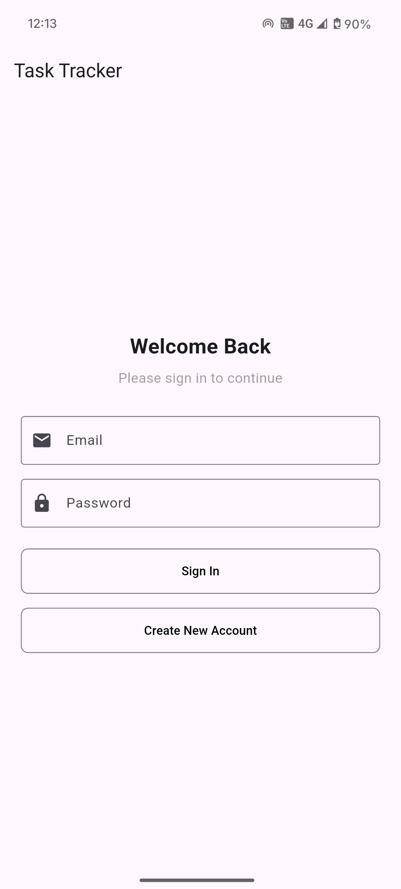
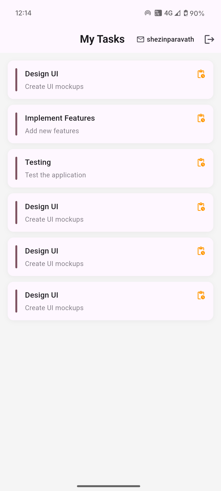
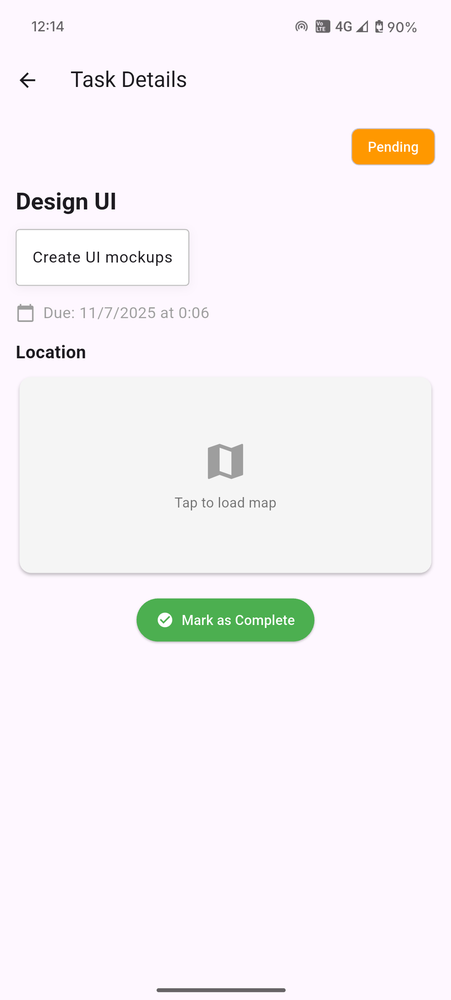
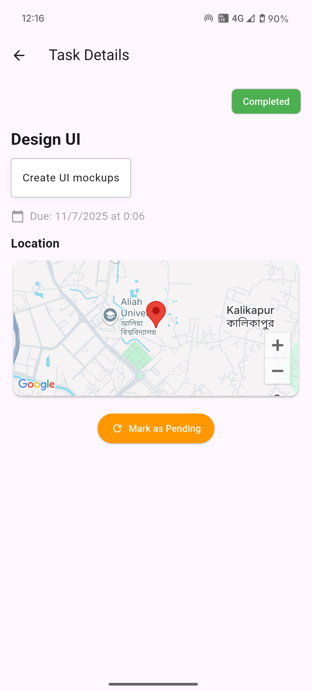

# Task Tracker App

A Flutter-based task tracking application with real-time updates, Firebase Authentication, and Google Maps integration.

## Features

- **Real-time Task Management**: View and update tasks with instant UI updates
- **User Authentication**: Secure email/password authentication using Firebase
- **Location Tracking**: View task locations on an interactive Google Map
- **Responsive Design**: Works on both Android and iOS devices
- **State Management**: Efficient state handling using GetX

## Prerequisites

- Flutter SDK (3.0.0 or higher)
- Dart SDK (2.17.0 or higher)
- Android Studio / VS Code with Flutter extensions
- Google account for Firebase and Maps API

## Setup Instructions

### 1. Clone the repository
```bash
git clone https://github.com/yourusername/Flutter_Developer_Test_ShezinP.git
cd task_tracker
```

### 2. Install dependencies
```bash
flutter pub get
```

### 3. Firebase Setup
1. Go to [Firebase Console](https://console.firebase.google.com/)
2. Create a new project
3. Add Android app with package name: `com.example.task_tracker`
4. Download `google-services.json` and place it in `android/app/`
5. Enable Email/Password authentication in Firebase Console

### 4. Google Maps API
1. Go to [Google Cloud Console](https://console.cloud.google.com/)
2. Enable Maps SDK for Android and iOS
3. Create an API key
4. Add the API key in `android/app/src/main/AndroidManifest.xml`:
```xml
<meta-data
    android:name="com.google.android.geo.API_KEY"
    android:value="YOUR_API_KEY"/>
```

### 5. Run the app
```bash
flutter run
```

## Project Structure

```
lib/
├── controllers/       # GetX controllers
│   ├── auth_controller.dart
│   ├── map_controller.dart
│   └── task_controller.dart
├── models/           # Data models
│   └── task_model.dart
├── routes/           # App routes
│   └── app_routes.dart
│   └── app_pages.dart
├── views/            # UI screens
│   ├── login_screen.dart
│   ├── task_details_screen.dart
│   └── task_list_screen.dart
└── main.dart         # App entry point
```

## Firebase Setup

### Authentication
- Email/Password authentication using Firebase Auth
- Secure user session management
- Basic error handling for login/signup flows

## GetX Implementation

### State Management
- Reactive state management using `.obs` variables
- Basic dependency injection with `Get.put()`
- Simple route management with `Get.to()` and `Get.off()`

### Controllers
1. **AuthController**
   - Handles user authentication
   - Manages login/logout state
   - Basic error handling

2. **TaskController**
   - Manages task-related state
   - Handles task CRUD operations

3. **MapController**
   - Manages Google Maps integration
   - Handles location-related functionality

## Google Maps Integration
- Basic map display in task details
- Simple marker placement
- Basic camera controls

## Performance Considerations
- Uses `Obx` for reactive UI updates
- Implements `ListView.builder` for task lists
- Basic controller lifecycle management
- Google maps lazy loading

## Challenges & Solutions

Challenge: Improper use of Obx() with non-reactive variables

Solution: Moved reactive variables inside Obx, ensured .obs usage

Challenge: Firebase internal error (CONFIGURATION_NOT_FOUND)

Solution: Fixed by correctly configuring Firebase and using proper google-services.json

Challenge: Platform limitations (iOS support)

Solution: Documented iOS steps but excluded from testing due to lack of macOS

Challenge: Initial GetX controller not found errors

Solution: Ensured all controllers were properly registered using Get.put()

## Performance Optimizations

- Used `Obx` for minimal widget rebuilds
- Optimized list rendering with `ListView.builder`
- Google maps lazy loading

## Screenshots

### Login Screen


### Task List


### Task Details





